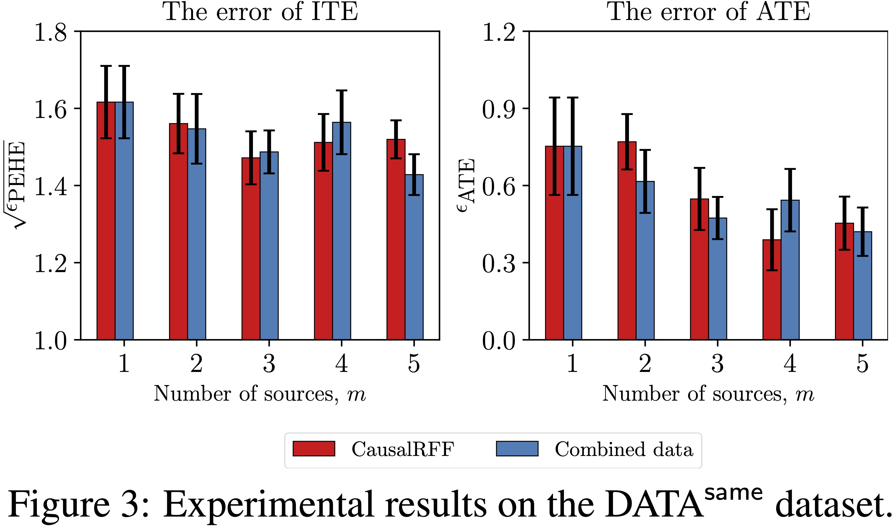
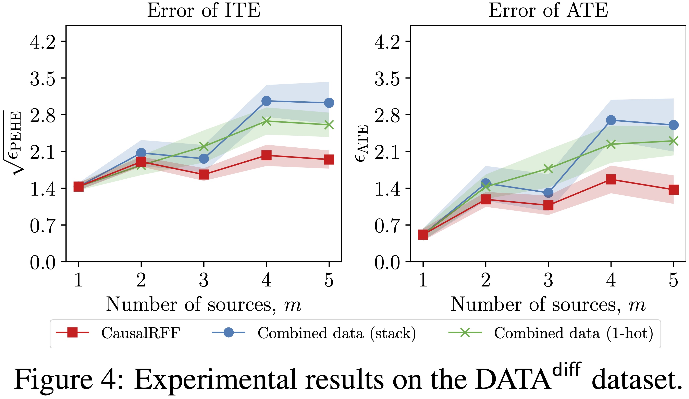
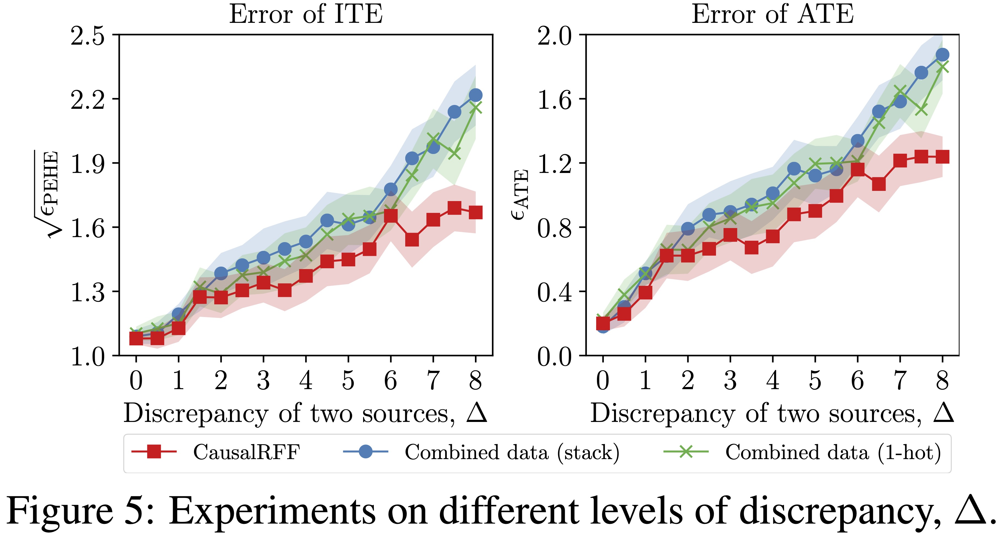
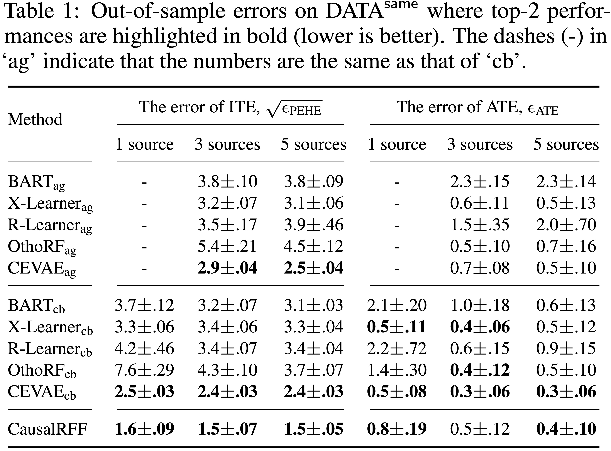
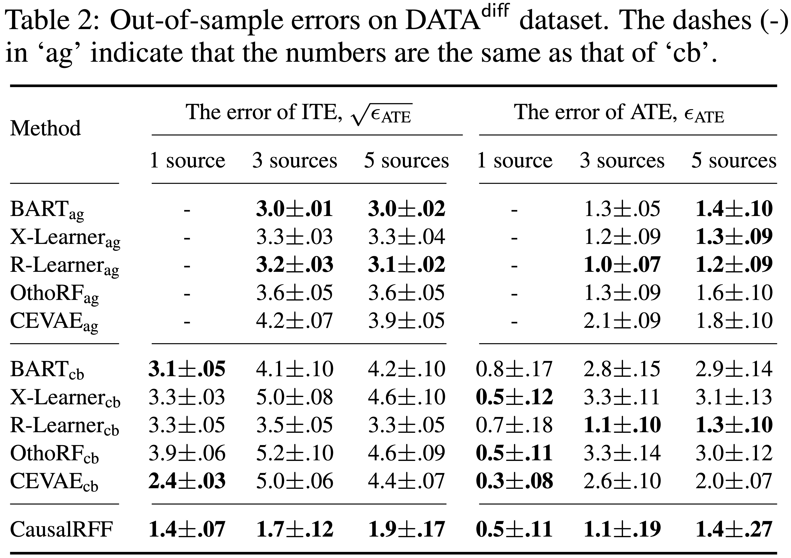
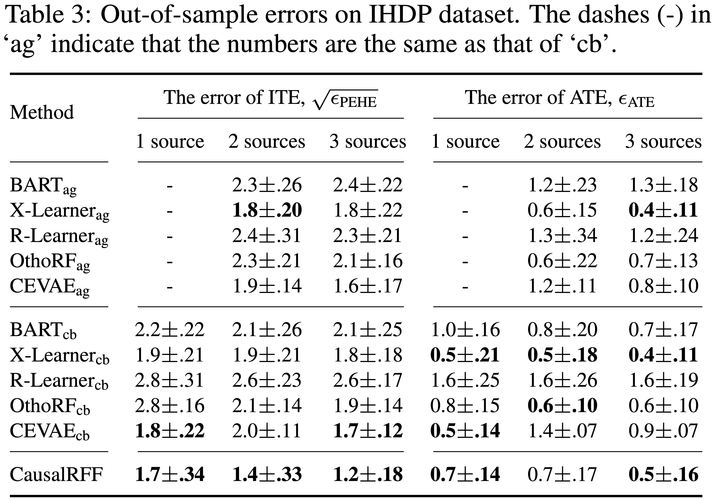

# An Adaptive Kernel Approach to Federated Learning of Heterogeneous Causal Effects

Vo, T. V., Bhattacharyya, A., Lee, Y., & Leong, T. Y. (2022). An Adaptive Kernel Approach to Federated Learning of Heterogeneous Causal Effects. *The 36th Conference on Neural Information Processing Systems* (**NeurIPS 2022**).

Please cite:

```
@proceedings{vo2022adaptive,
  title={An Adaptive Kernel Approach to Federated Learning of Heterogeneous Causal Effects},
  author={Vo, Thanh Vinh and Bhattacharyya, Arnab and Lee, Young and Leong, Tze-Yun},
  journal={The 36th Conference on Neural Information Processing Systems (NeurIPS)},
  year={2022}
}
```


## Table of Contents
- [Requirements](#requirements)
- [Import packages](#import-packages)
- [Using GPU or CPU](#using-gpu-or-cpu)
- [Load data](#load-data)
- [Convert numpy arrays to tensors](#convert-numpy-arrays-to-tensors)
- [Configuration](#configuration)
- [Train the model](#train-the-model)
- [Compute ITE and ATE](#compute-ite-and-ate)
- [Some examples](#some-examples)
- [Some experimental results](#some-experimental-results)


## Requirements
This code has been tested on:
```
pytorch==1.8.1+cu101
```

## Import packages

```python
import numpy as np
import torch
import pandas as pd
import scipy
from scipy.stats import sem
from scipy import stats
from load_datasets import IHDP
from model_train import *
from evaluation import Evaluation
```

## Using GPU or CPU
The following code would check whether GPU is available. If GPU is found, then we use it by default. Otherwise, we would use CPU. 
```python
if torch.cuda.is_available():
  torch.set_default_tensor_type('torch.cuda.FloatTensor')
  print('Use ***GPU***')
  print(torch.cuda.get_device_properties(0).total_memory/1024/1024/1024,'GB')
else:
  print('Use CPU')
device = torch.device("cuda:0" if torch.cuda.is_available() else "cpu")
```

## Load data
There are 3 datasets included in our sample codes: ```SynData5Sources, SynData5SourcesDiff, IHDP```. The following code would load the ```IHDP``` dataset:
```python
from load_datasets import SynData5Sources
dataset = SynData5Sources()
source_size = dataset.source_size
train_size = dataset.train_size
test_size = dataset.test_size
val_size = dataset.val_size
```

To load a new dataset, one can create a new class for that dataset in ```load_datasets.py```. The class should be similar to that of ```SynData5Sources```.

## Convert numpy arrays to tensors
* Let ```Ytr, Ytr_cf, Xtr, Wtr``` be ```numpy``` arrays of the training data.
* Let ```Yte, Yte_cf, Xte, Wte``` be ```numpy``` arrays of the testing data.

First we need to transform these numpy arrays into tensors:
```python
# Tensors of training data
xtr = torch.from_numpy(Xtr).float().to(device)
ytr = torch.from_numpy(Ytr.reshape(-1,1)).float().to(device)
wtr = torch.from_numpy(Wtr.reshape(-1,1)).float().to(device)

# Tensors of testing data
xte = torch.from_numpy(Xte).float().to(device)
yte = torch.from_numpy(Yte.reshape(-1,1)).float().to(device)
wte = torch.from_numpy(Wte.reshape(-1,1)).float().to(device)
```

## Configuration
```python
training_iter = 10000 # number of iterations
D = 400 # Dimension of Random Fourier Feature
learning_rate_w = 1e-2
learning_rate_y = 1e-2
learning_rate_zy = 1e-1
reg_beta_w = 1e-2
reg_beta_y = 1e-1
reg_sig_y = 1e-1
reg_beta_zy = 1e-1
transfer_flag = FLAGS_LEARN_TRANSFER
display_per_iters = 100
z_dim = 80 # Number of dimension of Z
is_binary_outcome = False
use_mh = True # False=use q(z) (option 1), True=use Metropolis-Hastings (option 2)
```

## Train the model

```python
print('*** P(W|X)')
model_server_w, model_sources_w, omega_w = trainW(train_x=xtr,
                                                  train_w=wtr.reshape(-1),
                                                  n_sources=m,
                                                  source_ranges=source_ranges_train,
                                                  D=D,
                                                  training_iter=training_iter,
                                                  learning_rate=learning_rate_w,
                                                  reg=reg_beta_w,
                                                  display_per_iters=display_per_iters,
                                                  transfer_flag=transfer_flag)

print('*** P(Y|X,W)')
model_server_y, model_sources_y, omega_y = trainY(train_x=xtr,
                                                  train_y=ytr,
                                                  train_w=wtr,
                                                  n_sources=m,
                                                  source_ranges=source_ranges_train,
                                                  D=D,
                                                  is_binary=is_binary_outcome,
                                                  training_iter=training_iter,
                                                  learning_rate=learning_rate_y,
                                                  reg_beta=reg_beta_y,
                                                  reg_sig=reg_sig_y,
                                                  display_per_iters=display_per_iters,
                                                  transfer_flag=transfer_flag)


print('*** P(Z|Y,X,W) and P(Y|W,Z)')
model_server_zy, model_sources_zy, omega_z, omega_xy = trainZY(train_x=xtr,
                                                              train_y=ytr,
                                                              train_w=wtr,
                                                              n_sources=m,
                                                              source_ranges=source_ranges_train,
                                                              feats_binary=feats_binary,
                                                              feats_continuous=feats_continuous,
                                                              is_binary=is_binary_outcome,
                                                              dim_z=z_dim, D=D, 
                                                              training_iter=training_iter,
                                                              display_per_iters=display_per_iters,
                                                              transfer_flag=transfer_flag,
                                                              reg_beta=reg_beta_zy,
                                                              learning_rate=learning_rate_zy)
```

## Compute ITE and ATE

```python
# Sample from P(W|X)
w_samples = sampleW(model_sources=model_sources_w,
                    x=xte,
                    n_sources=m,
                    source_ranges=source_ranges_test,
                    n_samples=100,
                    idx_sources_to_test=[0])

# Sample from P(Y|X,W)
y_samples_xw = sampleY(model_sources=model_sources_y,
                       x=xte,
                       w_samples=w_samples,
                       n_sources=m,
                       source_ranges=source_ranges_test,
                       n_samples=100,
                       idx_sources_to_test=[0]) # Change to [0,1,2] to test
                                                # on three sources 0, 1, 2
# Evaluate P(W|X)
test_stat_w = testW(model_sources=model_sources_w,
                    test_x=xte,
                    test_w=wte.reshape(-1),
                    n_sources=m,
                    source_ranges=source_ranges_test,
                    idx_sources_to_test=[0])  # Change to [0,1,2] to test
                                              # on three sources 0, 1, 2

# Evaluate P(Y|X,W)
test_stat_y = testY(model_sources=model_sources_y,
                    test_x=xte,
                    test_y=yte,
                    test_w=wte,
                    n_sources=m,
                    source_ranges=source_ranges_test,
                    idx_sources_to_test=[0])  # Change to [0,1,2] to test
                                              # on three sources 0, 1, 2

# Evaluate ATE, ITE
test_stats_TEs = testTEs(model_sources=model_sources_zy,
                         xte=xte,
                         wte=wte,
                         yte=yte,
                         y_cfte=y_cfte,
                         mute=mute,
                         w_samples=w_samples,
                         y_samples=y_samples_xw,
                         n_sources=m,
                         source_ranges=source_ranges_test,
                         n_samples=100,
                         idx_sources_to_test=[0], # Change to [0,1,2] to test
                                                  # on three sources 0, 1, 2
                         is_binary=is_binary_outcome,
                         use_mh=use_mh) # Use MH or not
```
The above code would print out the errors of ATE and ITE on testing. It also computes the prediction errors of `P(W|X)` and `P(Y|X,W)`.

## Some examples

Please refer to these notebooks as starting point:
* sample_code_synthetic1.ipynb
* sample_code_synthetic2.ipynb
* sample_code_ihdp.ipynb

## Some experimental results

_**Synthetic datasets**_

**Federated causal inference analysis**






**Compare with baselines on synthetic datasets**



***



<br />

***

_**IHDP dataset**_


